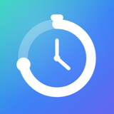
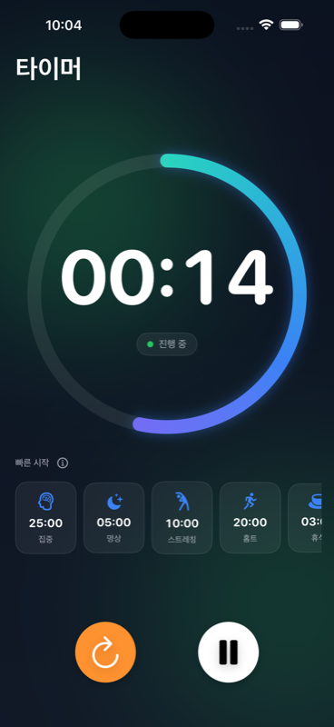
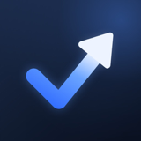
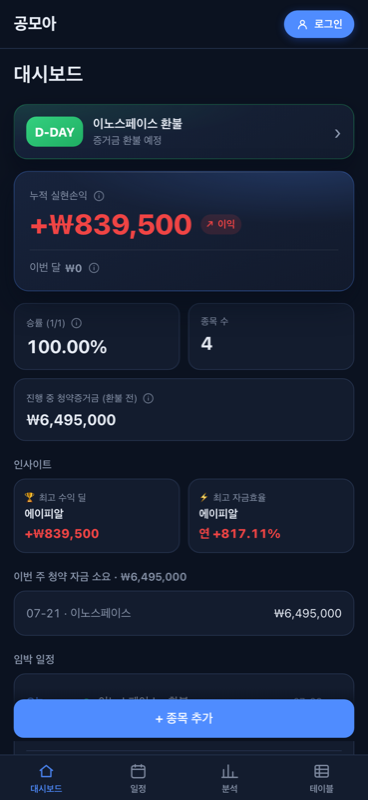
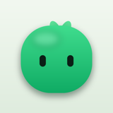
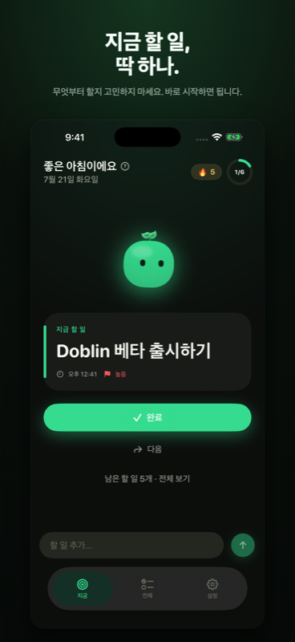
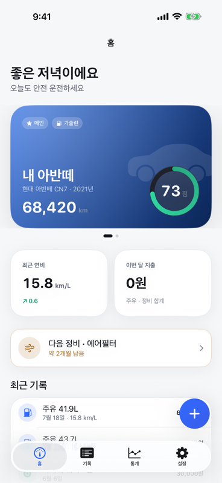

  

  <b>상용 iOS 앱 개발 · 개인 앱 기획부터 출시까지</b> 
  Swift · SwiftUI · ReactorKit / TCA · Clean Architecture · 웹-네이티브 하이브리드

  &nbsp;
  &nbsp;
  

 

## About Me

캐시워크에서 **4년간** 대규모 iOS 앱을 설계·개발하며 4,000+ 기여, 140K+ 라인을 작성했습니다.
회사에서는 수백만 사용자가 쓰는 앱의 안정성과 확장 가능한 구조를 다루고,
개인 프로젝트에서는 **기획 → 설계 → 구현 → 배포**까지 혼자 진행하며,
[**타이머핏**](https://apps.apple.com/kr/app/id6792751925) · [**공모아**](https://apps.apple.com/kr/app/id6793987876) · [**Doblin**](https://apps.apple.com/kr/app/id6793759598) · [**카지니어**](https://apps.apple.com/kr/app/id6797176247)
**네 개의 앱을 App Store에 직접 출시**했습니다. 출시로 끝내지 않고 업데이트를 이어가며, 스택 선택과 구조 결정을 매번 다시 검증합니다.

 

## Personal Projects

> 회사에서 검증한 구조를 개인 앱에서 다시 실험합니다.
> UIKit/RxSwift → SwiftUI/TCA → React + Capacitor 하이브리드까지, 스택을 직접 골라 끝까지 만들어 봅니다.
> **4개 앱 모두 App Store에 출시**했고, 출시 이후 업데이트도 이어가고 있습니다.

<table>
<tr>
<td align="center" width="25%">
 
<b>타이머핏</b> 
인터벌 서킷 타이머 · watchOS  
  

</td>
<td align="center" width="25%">
 
<b>공모아</b> 
공모주 청약 기록 · 손익 관리  
  
 
</td>
<td align="center" width="25%">
 
<b>Doblin</b> 
성장형 할 일 앱 · 5개 언어  
  

</td>
<td align="center" width="25%">
 
<b>카지니어</b> 
차계부 · 차량관리 · 연비  
  

</td>
</tr>
</table>

| Project | Period | Stack | Scale | Status |
|---------|--------|-------|-------|--------|
| **TimerFit** | 2025.04 ~ Present | SwiftUI · Combine · watchOS · WidgetKit | 269 commits · 77 PRs · 8.0K lines | 🚀 [**App Store**](https://apps.apple.com/kr/app/id6792751925) |
| **Gongmoa** | 2026.07 ~ Present | React · TypeScript · Capacitor · Supabase | 113 commits · 52 PRs · 7.9K lines | 🚀 [**App Store**](https://apps.apple.com/kr/app/id6793987876) |
| **Doblin** | 2026.07 ~ Present | SwiftUI · TCA · SwiftData | 67 commits · 16 PRs · 5.7K lines · 5개 언어 | 🚀 [**App Store**](https://apps.apple.com/kr/app/id6793759598) |
| **Cargineer** | 2025.04 ~ Present | SwiftUI · SwiftData · Swift Charts · 의존성 0 | 93 commits · 7.6K lines · 유닛 테스트 37건 | 🚀 [**App Store**](https://apps.apple.com/kr/app/id6797176247) |

<table>
<tr>
<td width="50%" valign="top">

### ⏱ TimerFit — 인터벌 서킷 타이머 App Store 출시 · v1.2.0

심플한 카운트다운 타이머에서 시작해 **라운드마다 다른 운동을 따라 하는 인터벌 서킷 타이머**로 확장한 iOS 앱. **기획부터 심사·출시까지 혼자 진행해 App Store에 정식 출시**했고, 이후 3번의 업데이트를 배포했습니다.

- 서킷 구간/라운드를 순차 진행하는 **상태 머신**(`IntervalTimerService`) 직접 설계
- **MVVM + Service 프로토콜 추상화**, 외부 의존성 0 · UserDefaults(Codable) 저장
- 타바타/HIIT/EMOM 프리셋 + **사용자 서킷·커스텀 운동 생성/편집**
- 플랫폼 중립 레이어(`TimerFitShared`)로 분리해 **watchOS 워치 앱 확장** — 아이폰-워치 루틴 동기화
- **v1.2.0** — App Group 공유 저장소로 이전 후 **홈 화면 위젯**(원탭 실행) · **Live Activity**(잠금화면·다이내믹 아일랜드 서킷 진행) · 구간 전환 예약 알림 추가
- **fastlane + GitHub Actions**로 아카이브 → TestFlight → 심사 제출 자동화
- App Store 4.2(최소 기능) 대응을 위해 제품 범위를 재설계 후 재제출 → **v1.0.0 출시**, 이후 워치 앱(v1.1.0) · 위젯/Live Activity(v1.2.0)까지 확장

</td>
<td width="50%" valign="top">

### 📈 Gongmoa (공모아) — 공모주 청약 관리 App Store 출시

 

헤비 공모주 비례 투자자를 위한 **청약 일정·기록·손익 자동 계산** 앱. 스프레드시트 수기 관리를 대체하며, **첫 커밋부터 App Store 출시까지 1주**에 완주했습니다.

- **웹 코어 하이브리드** — React + TS 코어를 Capacitor로 iOS 네이티브 셸에 탑재
- 같은 코어를 웹([gongmoa.app](https://gongmoa.app))으로도 배포 — **웹·iOS 동시 서비스**
- 파생 상태를 저장하지 않는 **단일 진실 원본** 설계 (손익·자금효율 항상 재계산)
- **오프라인 우선** — Repository 추상화로 SQLite(iOS)/IndexedDB(웹) 저장, 로그인 없이도 완전 동작
- **다기기 동기화** — Supabase Realtime · **RLS** 정책 · Edge Function 계정 삭제
- **Xcode Cloud CI** — 웹 코어 빌드를 네이티브 빌드 단계에 주입해 자동화
- 도메인 계산 로직 우선 테스트(Vitest), 모든 기능을 **PR 단위**로 분리 관리

</td>
</tr>
<tr>
<td width="50%" valign="top">

### 🧌 Doblin — 성장형 할 일 앱 App Store 출시

"오늘 지금 뭘 해야 하지?"에 답하는 할 일 앱. 완료할수록 자라는 캐릭터가 보상입니다. **v1.0.0을 App Store에 출시**했고, 후속 버전을 이어서 준비하고 있습니다.

- **TCA + SwiftData** — 단일 진실 원본, `TestStore` 기반 유닛 테스트
- 사용자 데이터가 생기기 전에 **SwiftData 스키마 버저닝** 선반영
- **자연어 날짜 파싱** 입력, 반복 작업(매일/주중/주간/월간), 홈 화면 **위젯**(App Group 공유)
- 로컬 알림(전역 + 작업별), 드래그 정렬 · 스와이프 · 실행 취소 토스트
- **5개 언어** 현지화 + 인앱 언어 전환, 다크 우선 테마, 접근성 패스
- **XcodeGen** 프로젝트 생성 · 재현 가능한 스크린샷 파이프라인 · **fastlane**으로 메타데이터/스크린샷 업로드까지 자동화

</td>
<td width="50%" valign="top">

### 🚗 Cargineer (카지니어) — 차계부·차량 관리 App Store 출시

주유·정비 기록과 실연비를 한 번에 관리하는 다중 차량 앱. **2025년 UIKit 프로토타입에서 멈춰 있던 것을 2026년 SwiftUI로 전면 재구축해 출시**했습니다.

- **재구축 전후** — 외부 의존성 4개(RxSwift·ReactorKit·SnapKit·Then) → **0개**, 도달 가능한 화면 2개 → **13개+**, 테스트 0건 → **유닛 테스트 37건**
- **SwiftUI + SwiftData + `@Observable`** — Core Data·`AppDelegate`·NotificationCenter 화면 통신을 걷어내고 SwiftUI 라이프사이클로 통일
- **도메인 엔진 3종**(프레임워크 의존 없는 순수 함수) — Full-to-Full 실연비 계산 · 정비 시기 예측(주행거리/기간 중 먼저 도래하는 쪽) · 차량 건강 점수
  - 기준점이 없는 **첫 주유는 연비를 계산하지 않습니다** — 추정값을 실측처럼 보여주지 않기 위한 선택
- **디자인 시스템** — 컬러 토큰 15종을 Light/Dark 두 벌로 Asset Catalog에 정의(뷰 코드에 색 리터럴 0개), 대비 검증 · Dynamic Type · Reduce Motion 대응
- Swift Charts 연비 추이 · 비용 도넛, 정비 예측 기반 **로컬 알림 자동 재예약**
- **fastlane**으로 서명·아카이브·TestFlight·메타데이터/스크린샷 업로드까지 자동화, Firebase는 추상화 뒤에 격리

</td>
</tr>
</table>

 

## Career

**Cashwalk Inc.** · iOS Developer · 2022.10 ~ Present

| Project | Period | Role | Scale |
|---------|--------|------|-------|
| **Cashwalk** | 2025.08 ~ Present | 혜택 탭 보물상자 전면 개편 · 홈 만보기 개편(A/B 테스트·광고) · 캐시로또 1·2차 · 위치 기반 O2O 리워드(동네산책) | 1,650+ commits · 188 merged PRs |
| **Geniet** | 2022.10 ~ 2025.12 | 건강관리 앱 — 만보기, 캐시로또, 웹뷰 브릿지 등 핵심 기능 | 3,560 commits · 106K+ lines |
| **CashHomeTraining** | 2024.02 ~ 2025.07 | 홈트레이닝 앱 — SwiftUI + TCA 기반 카메라/음성 안내 모듈 | 395 commits · SPM 독립 모듈 |

**Key Achievements**

- Clean Architecture + ReactorKit 기반 **167개 파일** 모듈 설계, 과도한 추상화 제거로 **432줄 삭제**
- 227개 파일 규모 개편을 **오픈 플로우 → 튜토리얼 → API → 배포**로 20+ PR 분리해 안전하게 배포
- 레거시 보물상자 화면 **MVC → ReactorKit 전환**, 만보기 포인트 획득 플로우 **A/B 테스트·광고 탑재**
- NMapsMap 기반 **18가지 마커 상태 머신** + 반경 기반 실시간 동기화, **장소별 리워드 차등 지급**까지 확장
- 하드코딩된 푸시 분기를 `FCMMessageType` enum 아키텍처로 재설계 — **30+ 타입 확장 가능 구조**
- 공통 햅틱 모듈 **CWHaptic** 도입, SwiftLint 경고 **415개 파일** 일괄 정리(빌드 경고 0), 웹뷰-네이티브 **20+ 브릿지** 구축

 

## Tech Stack

**Language & Framework**

     

**Architecture & State**

     

**Data & Backend**

    

**UI & Tooling**

         

 

## How I Work

> **"문제를 구조적으로 분석하고, 확장 가능한 해결책을 설계합니다."**

| Challenge | Approach | Result |
|-----------|----------|--------|
| 227개 파일 규모 기능 개편 | 오픈 플로우 → 튜토리얼 → API → 배포로 PR 분리 | 20+ PR 체계적 관리, 1차 배포 완료 |
| 보물상자 자정 경계값 오류 | 기기 시간 대신 서버 시간 기준 비교로 전환 | Race Condition 방어, 안정적 날짜 전환 |
| Clean Architecture 과도한 추상화 | 불필요한 UseCase 레이어 제거, Repository 직접 호출 | 432줄 삭제, 생산성 향상 |
| 개인 앱의 반복되는 배포 작업 | fastlane lane + GitHub Actions로 아카이브~심사 자동화 | 빌드마다 수동 작업 제거 |
| 1년 방치된 UIKit 프로토타입 | 부분 수정 대신 SwiftUI 전면 재구축 결정 | 의존성 4개 → 0개, 유닛 테스트 37건, App Store 출시 |

 

## Connect

  &nbsp;
  &nbsp;
  

